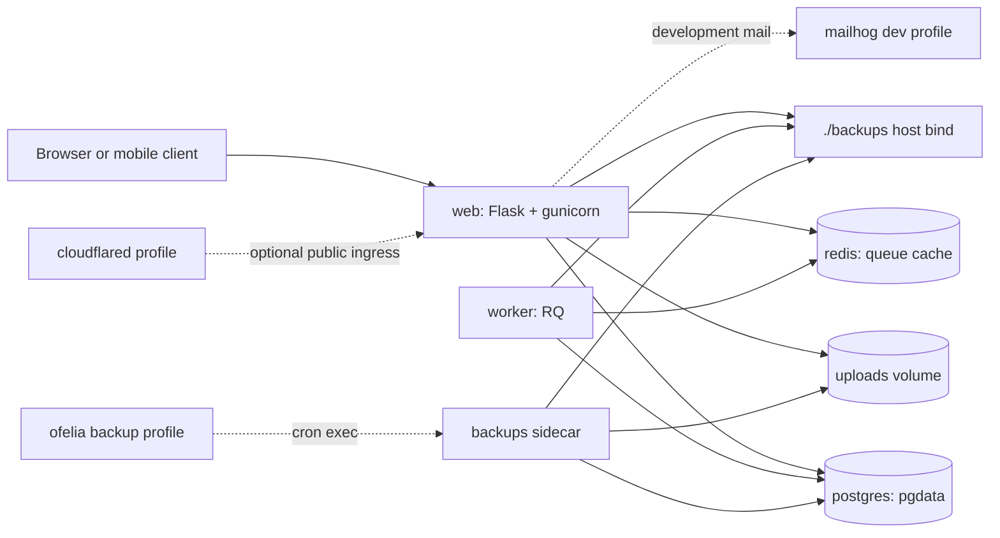

# Architecture

## Overview

Safe Harbor is a single-tenant, self-hosted Flask application.
The standard Docker Compose stack runs the web application, a PostgreSQL
database, Redis, and an RQ worker.
Optional profiles add a Cloudflare Tunnel, scheduled backups, and local mail
capture for development.

The default runtime path is intentionally small:
HTTP traffic reaches the Flask web process, persistent application state lands
in PostgreSQL and the uploads volume, and background work moves through Redis
to the worker.
The backup profile adds a scheduler and backup sidecar without moving backup
work into the web request path.

The Compose file uses these persistent storage points:

- `pgdata`, a named Docker volume mounted by PostgreSQL.
- `uploads`, a named Docker volume mounted by the web and backup services.
- `./backups/`, a host directory mounted at `/backups` by backup-aware services.

Redis has no named volume in the current Compose stack.
Its data is ephemeral queue state and can be recreated by restarting the stack.

## Services

`web` runs the Safe Harbor Flask app from the published
`ghcr.io/danner26/safeharbor` image.
It starts the app behind gunicorn, exposes port `8000` on the host, connects to
PostgreSQL through `DATABASE_URL`, and connects to Redis through `REDIS_URL`.
It mounts `uploads:/data/uploads` for user-uploaded files and mounts
`./backups:/backups:rw` so the application can create pre-upgrade backups before
running an upgrade workflow.

`worker` runs from the same Safe Harbor image as `web`.
Its command is `rq worker --url redis://redis:6379/0 default`, so it consumes
jobs from Redis queue `default` and executes asynchronous application work
outside the request process.
It connects to the same PostgreSQL database and Redis instance as `web`.
It also mounts `./backups:/backups:rw`, matching the backup path available to
the application image.

`postgres` runs PostgreSQL 16 on Alpine.
It is the canonical application database and stores its data in the named
`pgdata` volume at `/var/lib/postgresql/data`.
The healthcheck uses `pg_isready` so dependent services wait for the database to
accept connections before starting their own application logic.

`redis` runs Redis 7 on Alpine.
It provides the queue backend used by RQ and does not have a named volume in the
current Compose file.
Redis data should be treated as transient queue state; durable Safe Harbor data
lives in PostgreSQL, uploads, and backup archives instead.

`cloudflared` is gated behind the `tunnel` Compose profile.
When enabled, it runs Cloudflare Tunnel with `tunnel --no-autoupdate run` and
uses `TUNNEL_TOKEN` from the environment.
It depends on a healthy `web` service and provides optional public ingress
without changing how the application stores state.

`ofelia` is gated behind the `backup` Compose profile.
It runs the ofelia Docker scheduler and mounts the Docker socket read-only so it
can discover labeled containers and execute the configured backup command.
Its container filesystem is read-only and `no-new-privileges` is enabled, but
Docker socket access is still sensitive and should be used only on a trusted
host.

`backups` is gated behind the `backup` Compose profile.
It uses the Safe Harbor image and idles with `tail -f /dev/null` until ofelia or
an operator executes the backup or restore CLI inside it.
It mounts `uploads:/data/uploads:rw` and `./backups:/backups:rw`, which lets the
backup CLI read uploads for archives and lets the restore CLI replace uploads
when restoring a selected tarball.

`mailhog` is gated behind the `dev` Compose profile.
It exposes an SMTP endpoint on port `1025` and a web UI on port `8025`.
Use it for local mail capture during development; it is not part of the normal
runtime path for a deployed instance.

## Volumes

`pgdata` holds the PostgreSQL data directory.
It contains the canonical relational state for tanks, livestock, measurements,
users, sessions, and application metadata.
Do not wipe this volume unless you intend to delete the database or restore it
from a known-good backup.

`uploads` holds user-uploaded files at `/data/uploads`.
The web container uses it for normal file access, and the backup sidecar mounts
it read-write so restore operations can replace the uploads tree.
Do not wipe this volume unless the files are disposable or you are restoring
from a backup archive that contains the expected `uploads/` content.

`./backups/` is a host bind mount exposed to containers as `/backups`.
Backup tarballs are written here, and restore commands read tarballs from here.
It is safe to clean old archives only after confirming retention requirements
and any off-host copies.
If this directory is the only recovery point, do not wipe it.

Redis has no persistent volume in the current Compose file.
Queued jobs may be lost if Redis is restarted or recreated.
That is acceptable for this architecture because Redis is not the source of
truth for application records or uploaded files.

## Data Flows

Request lifecycle:
a browser or mobile client sends an HTTP request to `web` on port `8000`, or to
Cloudflare Tunnel when the optional tunnel profile fronts the app.
The Flask application handles routing, authentication, validation, and rendering.
It reads and writes durable records through PostgreSQL and reads or writes files
through the uploads volume.
If a request needs background work, the web process enqueues that work in Redis
instead of doing it inline.

Async job lifecycle:
`web` enqueues a job on Redis queue `default`.
The `worker` service listens to that queue with RQ and executes jobs using the
same application image as `web` and the Compose environment defined for worker
processes.
Worker code can read or update PostgreSQL as needed and can use the mounted
`/backups` path when the job or CLI operation needs local backup storage.
Redis tracks pending and in-progress queue items, but completed application
state must be committed to PostgreSQL or written to the appropriate file
volume.

Backup lifecycle:
with the `backup` profile enabled, ofelia reads the labels on the `backups`
service and executes `flask safeharbor backup` on the configured schedule.
The backup command creates a PostgreSQL custom-format dump, packages the
uploads tree, writes a temporary tarball under `/backups`, and atomically moves
the completed archive into place.
The host sees the result under `./backups/`.
Manual backups use the same CLI command and output path.

Pre-upgrade backup lifecycle:
the `web` service also mounts `./backups:/backups:rw`.
That writeable mount exists so an application-driven pre-upgrade backup can
write a local recovery archive before upgrade work starts.
The backup sidecar remains the normal scheduled backup path, but the web image
has the same host backup directory available for operator-triggered upgrade
safety checks.

Restore lifecycle:
an operator places or selects a Safe Harbor backup tarball under `./backups/`.
The restore command runs inside the `backups` sidecar, validates the tarball in
dry-run mode, and then, after explicit confirmation, replaces database contents
and upload files from the archive.
Follow the disaster recovery procedure in [Restore](restore.md) before running a
destructive restore.

## Backup Architecture

Backups are local archives produced by the Safe Harbor CLI.
Each archive includes a PostgreSQL dump named `db.dump` and an `uploads/` tree.
The current backup design keeps backup creation in the `backups` container and
scheduling in the `ofelia` container.
The scheduler tells Docker to execute the backup command inside the sidecar
rather than running cron in the web container.

The `backups` container mounts `uploads:/data/uploads:rw` so restore operations
can replace upload files from a selected archive.
It also mounts `./backups:/backups:rw` so backup commands can write new archives
and restore commands can read selected restore archives.

The web container mounts `./backups:/backups:rw` for operator-driven
pre-upgrade backup creation from the web image, while scheduled backups remain
owned by the backup profile.

For backup operation details, retention behavior, and off-host copy guidance,
see [Backups](backups.md).
For dry-run validation, destructive restore steps, and drift caveats, see
[Restore](restore.md).

## Where State Lives

PostgreSQL is the canonical store for application records.
If PostgreSQL is lost and there is no backup, the relational application state
is lost.
The `pgdata` volume is therefore the most important local runtime volume.

The `uploads` volume stores user files.
Database rows may reference files in this volume, so backups and restores treat
the database dump and uploads tree as one recovery unit.
Keeping only one of those two pieces can produce incomplete recovery.

Redis stores queue state and other transient runtime data.
Because the current Compose stack does not define a Redis volume, recreating
Redis discards pending queue state.
That is safe for storage recovery planning, but it may drop background jobs that
were waiting or running at the time of restart.

The `./backups/` directory is the local recovery point.
It should be treated as important operational data until it has been copied to
durable off-host storage or intentionally aged out by retention policy.
For practical recovery, keep backup archives somewhere outside the Docker host
as well as in the local bind mount.

## What's Not Here

Safe Harbor's Compose architecture does not include tenant isolation.
Run one stack per household, lab, or operator boundary.

It does not include object storage for uploads or backups.
The standard stack uses a Docker volume for uploads and a host bind directory
for backup tarballs.
Off-host copy is an operator responsibility.

It does not include cross-region replication or automated failover.
Recovery is based on restoring a selected local or off-host backup archive into
a working Safe Harbor deployment.

It does not define an application role-permission system beyond the app's
current authentication and authorization behavior.
Restrict administrative access through deployment practices, account hygiene,
and host-level controls.
